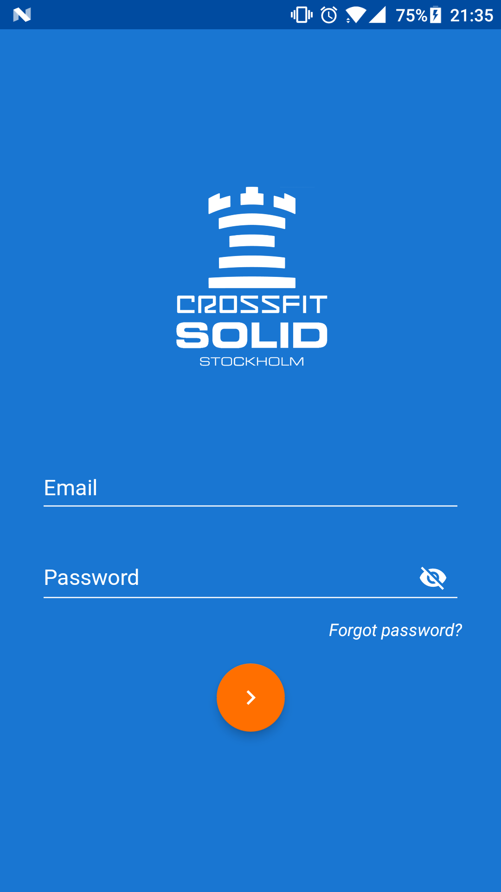
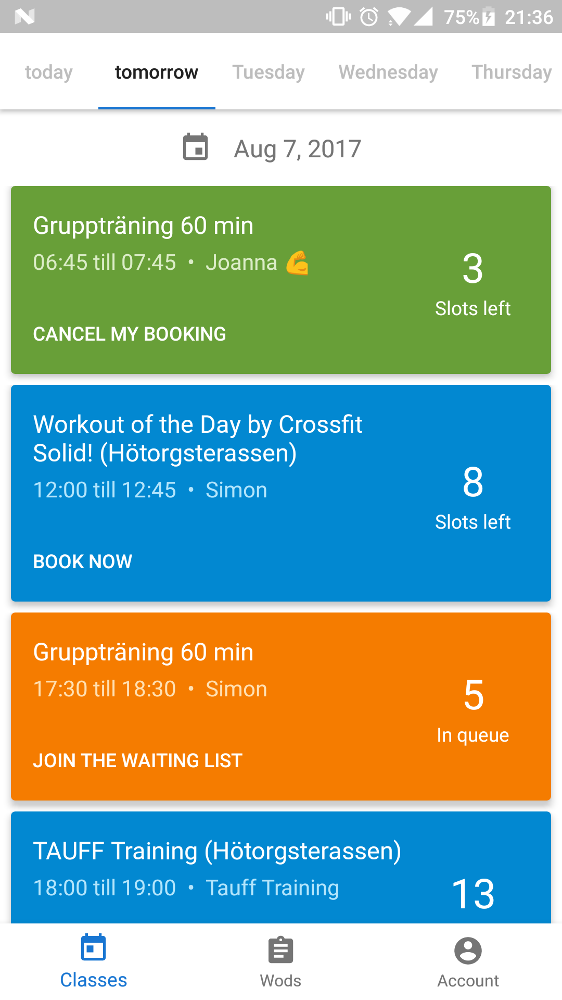
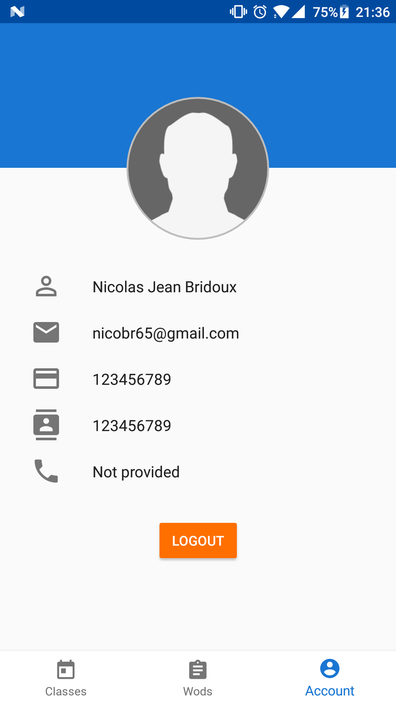

# CrossFit Solid Android app :muscle: #

Android app for CrossFit Solid [available on Google Play](https://play.google.com/store/apps/details?id=com.bridou_n.crossfitsolid).

  

Available for android 4.4+

## Features ##

The following informations are displayed:

- See the available classes and book them
- See the workout of the day and list all previous workouts as well
- Get notified everyday if a new WOD is revealed!
- See your profile informations

## Main libraries used ##

 - [Retrofit](http://square.github.io/retrofit/)
	 - Network calls (Auth, JSON and XML APIs)
 - [Realm](https://github.com/realm/realm-java)
	 - Storing and retrieving data on the phone (used to cache the list of wods)
 - [RxJava (& RxAndroid)](https://github.com/ReactiveX/RxJava)
	 - Paired with retrofit to make the network calls easier
 - [Dagger 2](https://google.github.io/dagger/)
	 - Inject dependencies into the app
 - [ButterKnife](https://github.com/JakeWharton/butterknife)
	 - Bind Android views to fields.
 - [Lottie](https://github.com/airbnb/lottie-android)
	  - To make it easier to run animations (used for the empty view in the classes)
 - [Android-job](https://github.com/evernote/android-job)
	 - Used to schedule jobs easily without having to deal with different Android APIs. Used to fire a network call everyday between 4am and 5am to check the daily wod.

## License ##

	Licensed under the Apache License, Version 2.0 (the "License");
    you may not use this file except in compliance with the License.
    You may obtain a copy of the License at

        http://www.apache.org/licenses/LICENSE-2.0

    Unless required by applicable law or agreed to in writing, software
    distributed under the License is distributed on an "AS IS" BASIS,
    WITHOUT WARRANTIES OR CONDITIONS OF ANY KIND, either express or implied.
    See the License for the specific language governing permissions and
    limitations under the License.

This software is available under the Apache License 2.0
